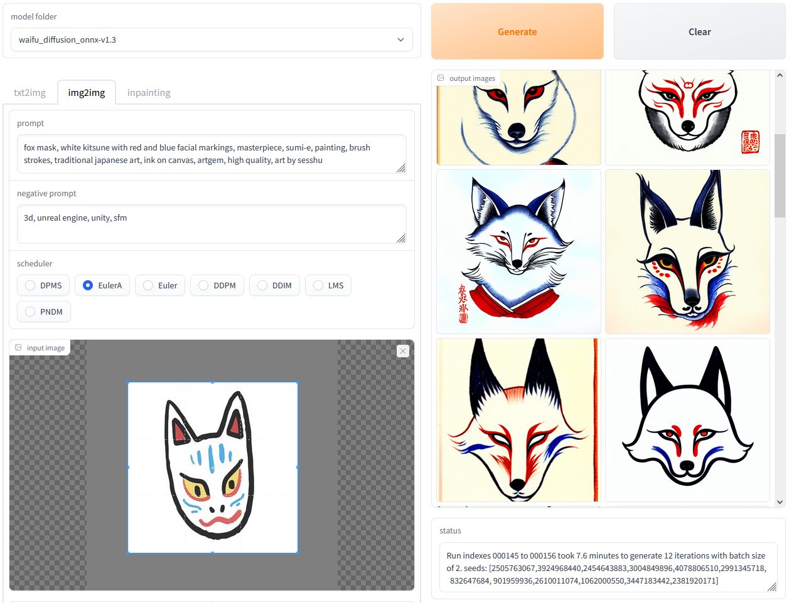

# OnnxDiffusersUI

I’ve been helping people setup Stable Diffusion and run it on their AMD graphics card (or CPU) on Windows. I’ve also wrote a basic UI for the diffusers library version to make it more user friendly. This guide is a consolidation of what I’ve learned and hopefully will help other people setup their PC to run Stable Diffusion too.

The intent of this UI is to get people started running Stable Diffusion on Windows. As such this UI won't be as feature rich as other UI, nor will it be as fast as running Stable Diffusion on Linux and ROCm.

**WIP Update:** Known issues:
- There's been a bug where DDIM and LMS schedulers will cause an error. See [this issue page](https://github.com/huggingface/diffusers/issues/967)
- img2img output is sub-standard on PNDM scheduler, not sure if this is expected
- the seed input for img2img does not generate the same image. See [this this page](https://github.com/huggingface/diffusers/pull/932)

Example screenshot:  


## Credits

A lot of this document is based on other guides. I've listed them below:
- https://www.travelneil.com/stable-diffusion-windows-amd.html
- https://gist.github.com/harishanand95/75f4515e6187a6aa3261af6ac6f61269#file-stable_diffusion-md
- https://rentry.org/ayymd-stable-diffustion-v1_4-guide
- https://gist.github.com/averad/256c507baa3dcc9464203dc14610d674

## Prerequisites

You'll need to have a few things prepared first:
- Install Python 3.10: <https://www.python.org/downloads/release/python-3108/>
    - NOTE: don't install the version of Python from the Microsoft Store
    - make sure that you enable "add Python to PATH" during the install
- Install Git for Windows: <https://git-scm.com/download/win>
    - just install with the default recommended settings
- Have a [huggingface.co](https://huggingface.co) account

NOTE: For Windows 10/11 you need to do an additional step. Go to Settings -> search for "Manage app execution aliases" -> disable the App Installer for "python.exe" and "python3.exe".

To check if they’re installed properly open up command prompt and run the following commands:  
```
python --version
git --version
pip --version
```  
There shouldn't be any "not recognized as an internal or external command" errors.

## Creating a Workspace

Start by creating a folder somewhere to store your project. I named mine `stable_diff`.

Download the `setup.bat` file and save it into your `stable_diff` folder: <https://raw.githubusercontent.com/azuritecoin/OnnxDiffusersUI/main/setup.bat>  
NOTE: make sure you save the file as a `.bat` file and not a `.bat.txt` file.

Open command prompt and navigate to your `stable_diff` folder. Once there run the `setup.bat` file:  
```shell
cd <path to your stable_diff folder>
.\setup.bat
```

The setup batch file should create a virtual envrionment and install the Python packages. It will also download Python scripts from online repositories.

Activate the virtual environment:  
`.\virtualenv\Scripts\activate.bat`

At this point you should be in your virtual environment and your prompt should have a `(virtualenv)` at the begining of the line. To exit the virtual environment just run `deactivate` at any time.

To restart the virtual environment after closing the command prompt window, `cd` back into the `stable_diff` folder and run the `.\virtualenv\Scripts\activate.bat` batch file again.

## Download Model and Convert to ONNX

Login to huggingface:  
`huggingface-cli.exe login`  
When it prompts you for your token, copy and paste your token from the huggingface website then press enter. NOTE: when pasting, the command prompt looks like nothing has happened. This is normal behaviour, just press enter and it should update.

Go to <https://huggingface.co/runwayml/stable-diffusion-v1-5> and accept the terms and conditions for the model.

### Option 1

Run the Python script to download and convert:  
`python convert_stable_diffusion_checkpoint_to_onnx.py --model_path="runwayml/stable-diffusion-v1-5" --output_path="model/stable_diffusion_onnx"`

NOTE: This may take a while depending on your internet connection speed.

### Option 2

Althernatively, you could download the pre-converted version of the model using git:  
`git clone https://huggingface.co/runwayml/stable-diffusion-v1-5 --branch onnx --single-branch model/stable_diffusion_onnx`

## Basic Script and Setup Check

Run the `txt2img_onnx.py` script and check if any images were generated in the output folder. NOTE: some warnings may show up but it should be working as long as an output image is generated:  
`python txt2img_onnx.py`

If an image was generated and it's not just a blank image then you're ready to generate art! You can use the `txt2img_onnx.py` script to input your own prompt for example:  
`python txt2img_onnx.py --prompt="tire swing hanging from a tree" --height=512 --width=512`

## Running The GUI

Run the UI script and wait for everything to load:  
`python onnxUI.py`

Once you see "Running on local URL:" open up your browser and go to "http[]()://127.0.0.1:7860". You should be able to generate images using the web UI. To close the program, go back to the command prompt and hit `ctrl-C`.

## Using Other Models

### Models Using Diffuers

If the model is on the hugging face website and it's using the diffusers library, then you can use the same convert script from the guide. In this example I'll use waifu-diffusion.  
`python convert_stable_diffusion_checkpoint_to_onnx.py --model_path="hakurei/waifu-diffusion" --output_path="model/waifu_diffusion_onnx"`

### Models Using `.ckpt`

If the pretrained model is a `.ckpt` file, then you'll need to do a two step conversion. You first will need to convert from .ckpt to diffusers, then from diffusers to ONNX.

Download the `.ckpt` model of your choice and put them in your `stable_diff` folder. Run the first conversion script, using trinart2_step115000.ckpt in this example:  
`python convert_original_stable_diffusion_to_diffusers.py --checkpoint_path="./trinart2_step115000.ckpt" --dump_path="./trinart2_step115000_diffusers"`  
Then run the second conversion script:  
`python convert_stable_diffusion_checkpoint_to_onnx.py --model_path="./trinart2_step115000_diffusers" --output_path="model/trinart2_step115000_onnx"`  
NOTE: make sure the `--dump_path` in the first script and the `--model_path` is the same folder name.

Once you have your newly converted model, you can pass it to the scripts using the `--model` parameter:  
`python onnxUI.py --model="model/waifu_diffusion_onnx"`

## Running Stable Diffusion on CPUs

If you don't have a graphics card with enough VRAM or you only have onboard graphics, you can still run Stable Diffusion with the CPU. Simply add a `--cpu-only` flag to your command line:  
`python txt2img_onnx.py --cpu-only`

## Updating onnxUI.py

If you want to update the program, download the latest `setup.bat` and overwrite the old one: <https://raw.githubusercontent.com/azuritecoin/OnnxDiffusersUI/main/setup.bat>

Then run the following:  
`.\setup.bat -update`

NOTE: if you're updating from diffusers v0.5.1 and below, you will need to re-convert your models.

## Running Other Schedulers

**WIP Update:** There has been an [issue raised](https://github.com/huggingface/diffusers/issues/967) to fix the bug but it's not in v0.6.0.

Currently the diffusers library supports PNDM, DDIM, and LMS Discrete schedulers. By default the scripts I've provided only uses PNDM. In the mean time you can edit the diffusers library directly. There's two file you need to modify: `pipeline_onnx_stable_diffusion.py` and `pipeline_onnx_stable_diffusion_img2img.py`

### Editing `pipeline_onnx_stable_diffusion.py`

Go open the first file in notepad `stable_diff\virtualenv\Lib\site-packages\diffusers\pipelines\stable_diffusion\pipeline_onnx_stable_diffusion.py`.

- On line 4, this line:  
```python
import numpy as np
```  
add this line underneath:  
```python
import numpy as np
import torch
```

- On line 153 change this:  
```python
latents = latents * self.scheduler.init_noise_sigma
```  
to this:  
```python
latents = latents * np.array(self.scheduler.init_noise_sigma)
```

- On line 171 change this:  
```python
sample=latent_model_input, timestep=np.array([t]), encoder_hidden_states=text_embeddings
```  
to this:  
```python
sample=latent_model_input, timestep=np.array([t], dtype=np.int64), encoder_hidden_states=text_embeddings
```

- On line 181, this line:  
```python
latents = self.scheduler.step(noise_pred, t, latents, **extra_step_kwargs).prev_sample
```  
add this line above:  
```python
latents = torch.tensor(latents)
latents = self.scheduler.step(noise_pred, t, latents, **extra_step_kwargs).prev_sample
```

### Editing `pipeline_onnx_stable_diffusion_img2img.py`

Go open the second file in notepad `stable_diff\virtualenv\Lib\site-packages\diffusers\pipelines\stable_diffusion\pipeline_onnx_stable_diffusion_img2img.py`.

- On line 327 change this:  
```python
sample=latent_model_input, timestep=np.array([t]), encoder_hidden_states=text_embeddings
```  
to this:  
```python
sample=latent_model_input, timestep=np.array([t], dtype=np.int64), encoder_hidden_states=text_embeddings
```

- On line 336, this line:  
```python
latents = self.scheduler.step(noise_pred, t, latents, **extra_step_kwargs).prev_sample
```  
add this line above:  
```python
latents = torch.tensor(latents)
latents = self.scheduler.step(noise_pred, t, latents, **extra_step_kwargs).prev_sample
```

### Undoing Your Changes

If you messed something up editing the two files, you need to re-install diffusers using `pip`:  
```
pip uninstall diffusers
pip install diffusers==0.6.0
```
